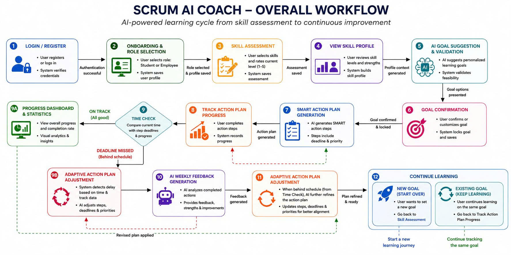
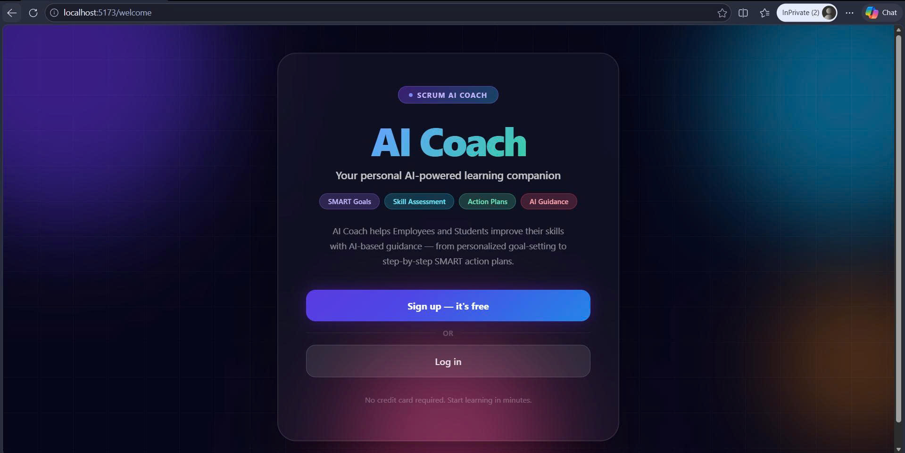
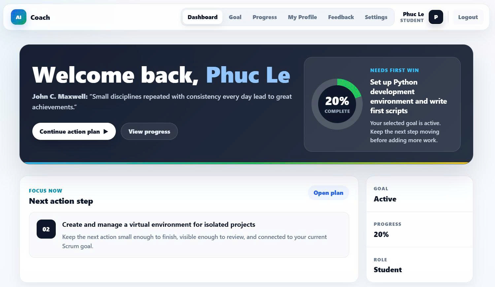

# AI Coach

AI Coach is a Scrum-focused coaching application that helps users assess skills, generate learning goals, build action plans, track progress, and manage profile settings.

## Workflow Overview



## Tech Stack

- Frontend: React, Vite, Supabase client
- Backend: FastAPI, Supabase, Groq
- Package managers: npm, uv

## Project Structure

```text
AI-Coach/
+-- backend/
|   +-- app/
|   |   +-- main.py
|   |   +-- goal_suggestion.py
|   |   +-- action_plan.py
|   +-- pyproject.toml
|   +-- .env.example
+-- frontend/
|   +-- src/
|   +-- package.json
|   +-- .env.example
+-- README.md
```

## Setup

### Backend

```bash
cd backend
uv sync
cp .env.example .env
uv run uvicorn app.main:app --reload
```

The backend runs at `http://127.0.0.1:8000`.

### Frontend

```bash
cd frontend
npm install
cp .env.example .env
npm run dev
```

The frontend runs at the local Vite URL shown in the terminal.

## Environment Variables

Create local `.env` files from the provided examples:

- `backend/.env.example`
- `frontend/.env.example`

## Main Features

- User authentication and profile management
- Skill assessment and skill profile tracking
- AI-generated goal suggestions
- AI-generated action plans
- Progress dashboard and task status updates
- Feedback and settings pages

## Screenshots

### Homepage


### Progress Dashboard


## Notes

- Backend API calls are currently configured for local development at `http://127.0.0.1:8000`.
- Supabase credentials are required for authentication and data access.
- Groq credentials are required for AI goal and action plan generation.

## SCRUM Team

| Name | Email | Gender | Team | Role |
| --- | --- | --- | --- | --- |
| Nguyễn Nhật Phát | nhatphatnguyen.ai@gmail.com | Male | Seven Eleven | PO |
| Trần Quốc Huy | huytranquoc24@gmail.com | Male | Seven Eleven | SM |
| Bùi Trần Tấn Phát | 23110052@student.hcmute.edu.vn | Male | Seven Eleven | DEV |
| Lê Hữu Trực | lehuutruc28122005@gmail.com | Male | Seven Eleven | DEV |
| Nguyễn Đức Thắng | 23110062@student.hcmute.edu.vn | Male | Seven Eleven | DEV |
| Nguyễn Phi Long | philong300905@gmail.com | Male | Seven Eleven | DEV |
| Nguyễn Thành Triệu | 23110066@student.hcmute.edu.vn | Male | Seven Eleven | DEV |
